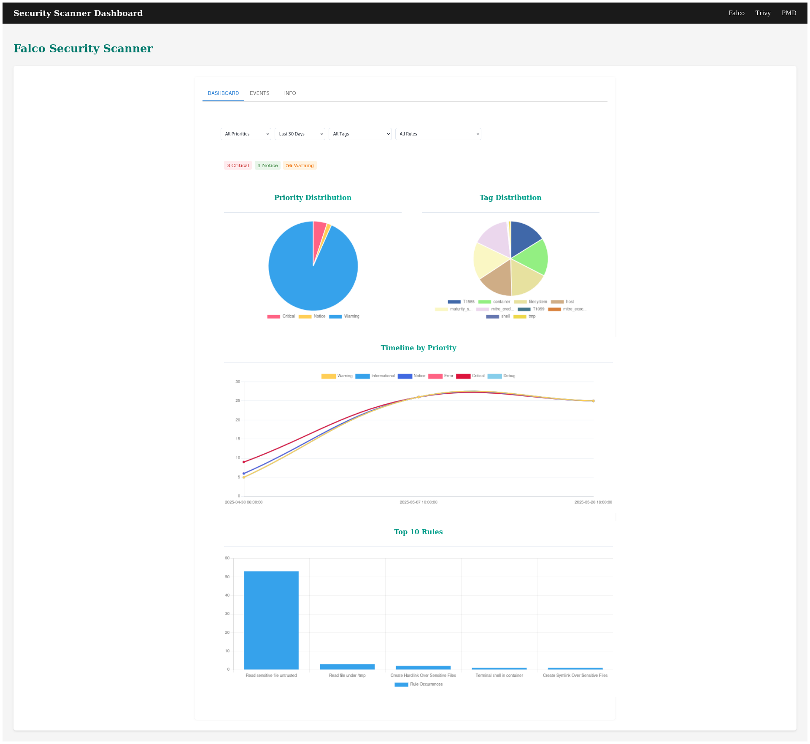
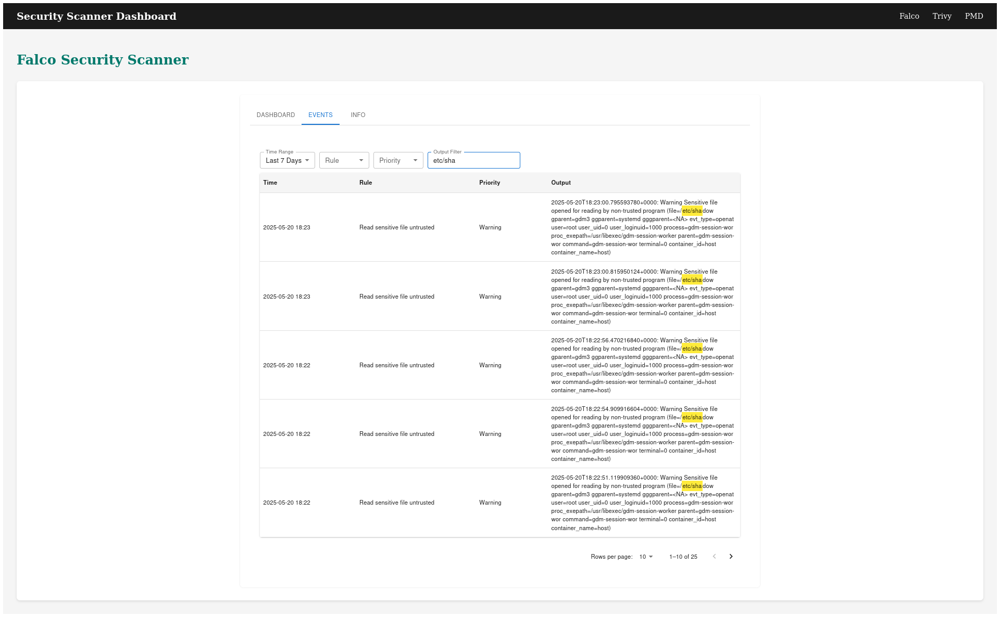
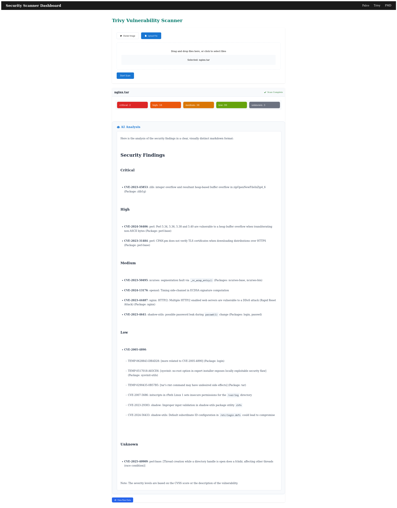
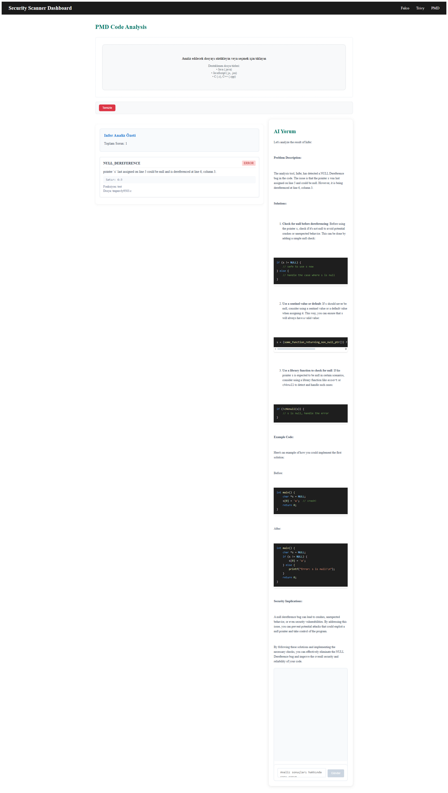

# VulnerPlus – AI-Powered Security and Code Quality Platform

## Project Description

In this project, a system supported by open-source tools has been developed for the detection and analysis of security vulnerabilities. **Falco** is used to monitor real-time system behaviors, **Trivy** scans container images for known vulnerabilities, and **PMD** and **Infer** are employed for static source code analysis. The data obtained from these tools is interpreted with the help of artificial intelligence to produce readable and actionable security assessments. The goal is to reduce the need for manual analysis and provide developers with automated, AI-driven insights.

---

## Technologies Used

* Python 3
* FastAPI
* SQLite
* Trivy
* Falco
* PMD (Java/JS)
* Infer (C/C++)
* Ollama (LLaMA-based AI comment engine)

---

## Installation

1. Install the required dependencies:

```bash
pip install -r requirements.txt
```

2. Install PMD and Infer tools:

* [PMD](https://pmd.github.io)
* [Infer](https://github.com/facebook/infer/blob/main/INSTALL.md)

3. To initialize the SQLite database for Falco logs:

```bash
python -c "from app.routes.falco import init_db; init_db()"
```

4. Start the application:

```bash
uvicorn app.main:app --reload
```

---

## Frontend Setup

The frontend is located under the `app/client` directory. Before using it, you need to build the application:

```bash
cd app/client
npm install
npm run build
```

This will generate a production-ready version of the frontend.

## Features and API Endpoints

### Falco – Real-Time Event Monitoring

To use Falco with this system, you need to configure the `falco.yaml` file before starting the service. Falco is typically run via `docker-compose` and sends security event logs over HTTP to your backend.

#### HTTP Output Configuration

Edit the following section in your `falco.yaml` file to include your machine's IP address:

```yaml
http_output:
  enabled: true
  url: "http://<your-ip>:8000/falco/logs"
```

#### Finding Your IP Address

To find your local IP address (used in the `url` above):

**Linux/macOS:**

```bash
hostname -I
```

or

```bash
ip addr show | grep inet
```

**Windows (CMD or PowerShell):**

```bash
ipconfig
```

Use the IPv4 address listed under your active adapter.

After configuring the IP, start Falco with:

```bash
docker compose up -d
```

#### Custom Falco Rules

You can define your own rules to monitor specific behaviors or events. Use the following path as a reference to review or customize rules:

```
falco/falco_rules.local.yaml
```
After configuring the falco rules, restart Falco with:
```bash
docker compose restart 
```

This allows you to tailor Falco alerts to your specific security requirements.
* `/falco`: Fetches the latest N logs; optionally analyzed by AI
* `/falco/events`: Logs filtered by time range, priority, and pagination
* `/falco/dashboard`: Statistics by rule, tag, and timestamp
* `/falco/logs`: Receives Falco JSON logs

**Dashboard Screenshot:**


**Events Page Screenshot:**


### Trivy – Vulnerability Scanning

* `/trivy`: Scan Docker image
* `/trivy/file`: Scan uploaded file
* `/trivy/analyze`, `/trivy/analyze/file`: Scan + AI interpretation
* `/trivy/ai-status/{id}`: Background AI analysis result

**Trivy File Scan Screenshot:**


### PMD – Java/JS Static Code Analysis

* `/analyze`: Analyze uploaded `.java` or `.js` file
* `/ai-status/{id}`: Status and result of AI analysis
* `/chat`: Chat with AI regarding source code

**PMD Java File Analysis Screenshot:**



### Infer – C/C++ Static Code Analysis

* `/analyze`: Analyze uploaded `.c` or `.cpp` file
* `/ai-status/{id}`: Status and result of AI analysis
* `/chat`: Chat with AI regarding code and results

---

## AI-Powered Analysis

All security and code scan results are interpreted using a LLaMA-based AI engine. These insights help users make faster decisions and apply suggested improvements.

---

## Contact

LinkedIn: [linkedin.com/in/dilara-ünsal](https://linkedin.com/in/dilara-ünsal)
